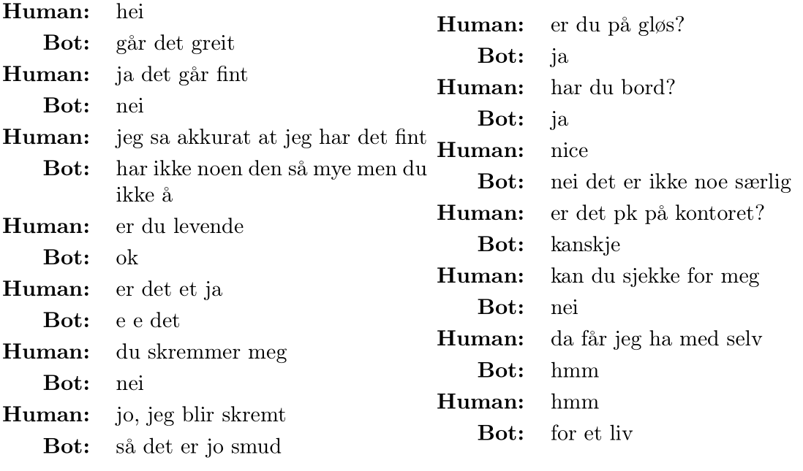

# generative-chatbot

Generative chatbot project created during the course TDT4310, by Torjus Iveland
and Vegar Andreas Bergum. 

A detailed paper presenting the work, method, implementation, feature
extraction and evaluation results is provided here: [Norwegian Generative
Chatbot using Personal Chat Log Data.](docs/report.pdf)

## Setup
Before attempting to run this project, ensure that you have Tensorflow
installed. We use `pipenv` for package management, so please ensure it is also
installed.

To install all packages required for the project, run `pipenv install.` Once
this command is finished, you can use `pipenv shell` to open a shell with all
the required packages installed.

Due to privacy reasons, we do not include our corpus in this repository. This
chatbot is designed to be used with a variety of corpora, and support for the
Cornell movie dialogue corpus and for Facebook Messenger data is already
included. In order to construct a corpus with Messenger data, you need to sign
in to your own Facebook account and export your data as JSON. Once this process
is finished, you can extract the files into a folder in the root of this
project named `corpus`.

Once the corpus has been created, the chatbot can be trained. To run the
chatbot, run `python main.py`. This will initialize the training process or
load a pre-trained model from disk, and accept input to the chatbot from the
command line.

It is possible to continue training of an already existing chatbot. To do this,
run the main script with the `INITIAL_EPOCH` environment variable set. For
example, run `INITIAL_EPOCH=101 python main.py` to continue training from epoch
101.

## Usage
Initialization of the `Chatbot`-object starts the data-preprocessing and
traingin phase. The object can then return replies to strings.

```python
import Chatbot
chatbot = Chatbot()
print(chatbot.reply('Hei'))
```

## Environment variables

| Variable            | Description                                       | Example value  | Default value |
|---------------------|---------------------------------------------------|----------------|---------------|
| MAX_NUM_TOKENS      | Maximum number of tokens allowed in a sentence.   | 50             | 20            |
| MAX_NUM_UTTERANCES  | Maximum number of utterances to load from corpus. | 5000           | 250000        |
| TARGET_USER         | Only use this username to generate responses.     | Torjus Iveland | None          |
| REMOVE_SELF_REPLIES | Filter away self-responses.                       | False          | True          |
| MAX_VOCABULARY_SIZE | Max number of different tokens to consider.       | 7500           | 1000          |
| USE_CORNELL_CORPUS  | Whether or not to use an English corpus.          | True           | False         |

## Results
Some of the resulting chatlogs from the project report can be seen below. Both
Norwegian and English logs are provided, where the English model has been
trained on 10,000 utterances from the Cornell Movie Dialog dataset, and the
Norwegian model is trained on 10,000 utterances from personal Facebook
Messenger data. 


Both the Norwegian and English logs illustrates some of the strengths and
weaknesses of the models. E.g. the English model's bias can be identified from
common movie quotes such as "in the sight of god that is a sin".


